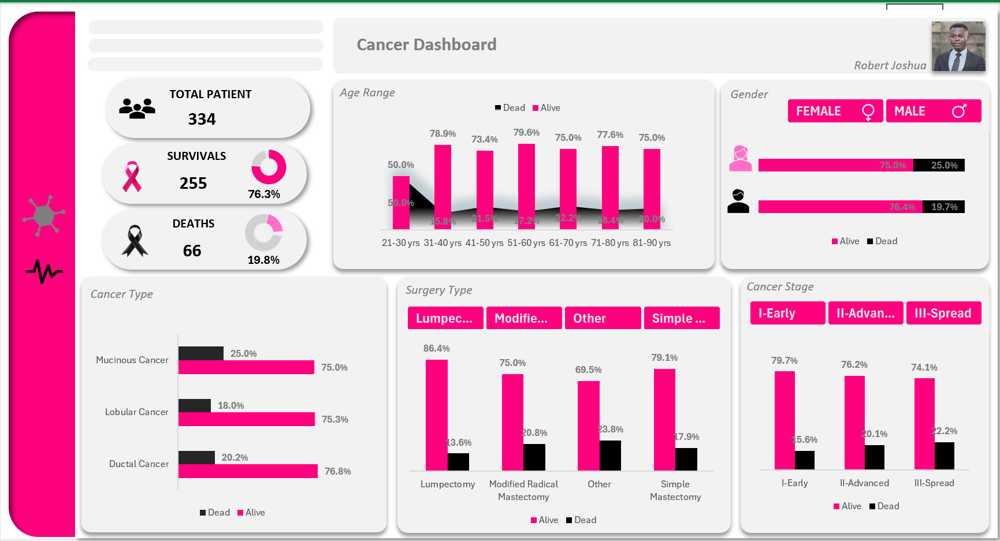
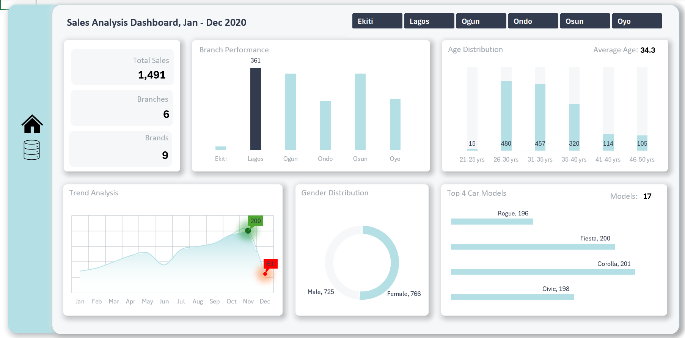
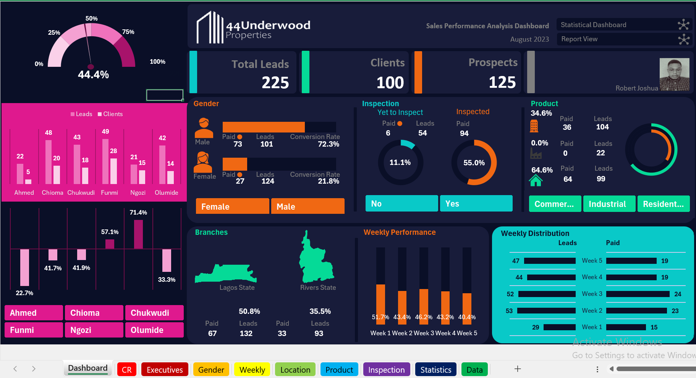

  

## ABOUT ME
Hello! I'm Joshua Robert, a dedicated professional with a strong foundation in both administrative operations and data analysis, I bring a unique blend of organizational precision and analytical insight to every role I undertake. With hands-on experience managing administrative workflows and extracting actionable intelligence from data, I excel at supporting business efficiency and decision-making across departments

## WHAT I DO

💼 **Technical Skills**
I use tools like Python (Pandas, NumPy), SQL, Excel, and data visualization platforms like Tableau and Power BI to analyze and present data effectively.

📊 **Analytical Techniques**
I'm skilled in exploratory data analysis, A/B testing, regression, and forecasting—techniques I use to draw insights and solve real-world problems.

🧠 **Soft Skills**
I enjoy turning data into stories that drive decisions, and I’m confident in communicating insights and collaborating with both technical and non-technical stakeholders.

## MY PORTFOLIO 

*A glimpse of some of the projects I've been working on.*

**Cancer Project that drove strategic decision-making in healthcare management, insurance, and patient care.**

**Descriptive analytics to help us better understand sales performance,Using a Car sales Dataset.**

**Descriptive analytics to help us better understand sales performance,Using a Real Estate Company Dataset.**

Unfortunately, there weren’t enough lifeboats for everyone onboard, resulting in the death of 1502 out of 2224 passengers and crew. 

<a href="">Download the Report here (pdf file)</a>

## CONTACT DETAILS

*Let’s connect and see how we can make a difference together!*
<table>
  <tbody>
    <tr>
      <td>📧</td>
      <td><a href="mailto:robertjoshua82@yahoo.com">robertjoshua82@yahoo.com</a></td>
    </tr>
    <tr>
      <td>📞</td>
      <td>(234) 706-211-3633</td>
    </tr>
    <tr>
      <td>📍</td>
      <td>Abuja, Nigeria</td>
    </tr>
    <tr>
      <td>🌐</td>
      <td><a href="linkedin.com/in/joshua-robert-81044b365">The things I do daily on LinkedIn</a></td>
    </tr>
  </tbody>
</table>
